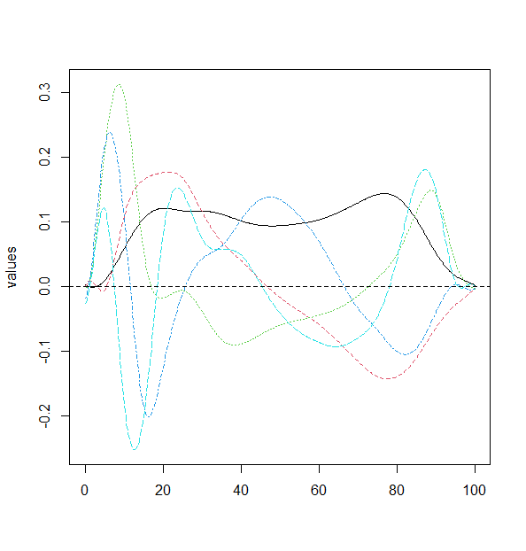

```{r setup, include=FALSE}
knitr::opts_chunk$set(echo = TRUE)
source(file = 'fPCA.R')
source(file = 'Autoencoder Andrew.R')
```

\newpage

# Introduction

This report will provide an explanation of the techniques our team used to perform dimension reduction and data reconstruction. The data we were provided for this project was force plate data compiled by a team of graduate students at the Boston University Sargent College of Health and Rehabilitation Services. Our team chose to use the time normalized stance data in our data reconstruction. Each dataset includes trial records for 15696 individuals. Each trial spans 100 time normalized data points.

Since the dataset was comprised of a large number of features for each trial, our team used PCA, Autoencoders and fPCA techniques to perform dimesion reduction. This enabled us to see which features were most significantly contributing to the data, and to reduce down correlations between time points.


(Explain dimension reduction, reconstruction)

# Approach Summary

PCA
Autoencoder
fPCA


# Why is Reconstruction Useful?

- quantify the loss of the dimension reduced data set
- PCA: data is reconstructed using only the specified principal components
- Autoencoder: data is decoded using the weights assigned during the bottleneck layer
- allows us to create a dataset that is comparable to the original after dimension reduction

# PCA Reconstruction Error

Our team began this project by performing a principal component analysis of the V GRF Stance time normalized data. From our PCA we then reconstructed the data to calculate the reconstruction error. This will tell us how much error there is when the data is reconstructed using a reduced number of dimensions. The plots below illustrate the PCA performance in two ways. The first shows the percentage of variation explained by each of the principal components, the first two combined explained over 90% of the variance. The second shows the mean squared reconstruction error, which decreases substantially with k additional principal components.


# Autoencoder

Our team created a simple autoencoder as a second method to perform dimension reduction on the data. 

(Explain what an autoencoder does/is)

The autoencoder was done using the V GRF Stance time normalized data. The parameters of the auto encoder are shown below. The bottleneck layer assigned weights to the encoded data. These weights were then used to decode the data using a reduced number of dimensions. We calculated the reconstruction error of the auto encoder using the mean squared error and got a loss of 0.0004. We decided to rerun this model with varying values for the bottleneck layer to see if we could get a lower reconstruction error but found that regardless of the bottleneck layer size the reconstruction loss stayed the same.


# fPCA

We decided to use functional principal component analysis due to the sequential nature of the data set. Functional principal component analysis was done on each of the time normalized data sets. 

(Explain the parameters of the fPCA)

We found that each data set could be explained using at most five principal components. With five principal components we could explain about 90% of the variation in the data for the ML GRF Stance data as well as the AP GRF Stance data. The V GRF stance data was able to be explained to the same degree with only two principal components. Due to the way our fPCA was constructed we were unable to reconstruct the data. If we were given more time we could construct our fPCA differently so that the data may be reconstructed. If this is done then we would be able to compare the reconstruction error of our fPCA to that of the auto encoder.





# Conclusion
Ultimately this work leads to better understanding of the data and the processes that generate it. (Add more)
